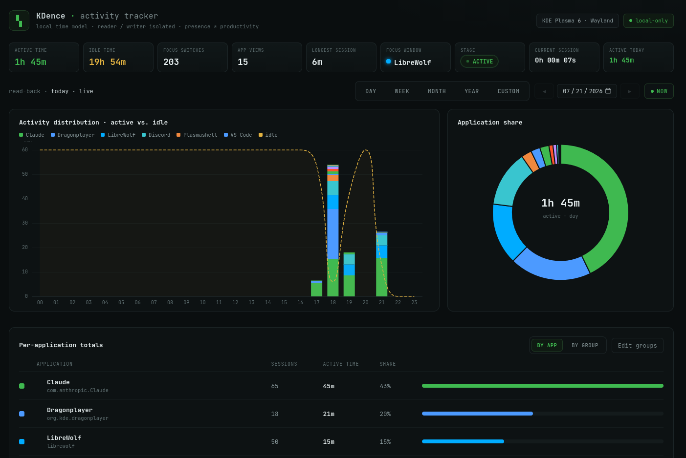

# KDence

**A local, privacy-preserving activity tracker for KDE Plasma 6 on Wayland**


## Overview

I built KDence because I could never find a clean, honest way to see *which windows I was
using and at what point in the day* on my own Linux desktop. The trackers I came across were
either cloud-based, built for other operating systems, or just never gave me a clear picture
of where my time on KDE Plasma was actually going — so I decided to make the thing I wanted
myself. KDence runs quietly in the background from the moment you log in, watches what's
focused and whether you're genuinely at the keyboard, and turns that into an honest timeline
of your day. The whole point was that anyone could install it, forget about it, and trust that
it keeps running and keeps working — no babysitting, no accounts, nothing leaving the machine.

Everything stays local: no cloud, no telemetry, no network egress. It's also deliberately
*honest* about what it measures — presence at the keyboard is not the same as productivity, and
the [honesty review](docs/honesty-review.md) spells out exactly what the numbers do and don't
mean.

## Demo

> **Screenshot placeholder** — the dashboard needs a live KDE session to render. Run it
> locally (see [Install & run](#install--run)) and drop a capture at `docs/images/dashboard.png`.



The dashboard is a dark-terminal live view served by the app itself at `http://127.0.0.1:5785`:
per-application and per-category totals, a timeline, and a Day/Week/Month/Year/Custom navigator
over your whole history. It polls every ~2s, so it tracks reality and freezes when you go idle.

## Tech Stack

- **Python 3.13**, managed with [`uv`](https://docs.astral.sh/uv/) — stdlib-first by design.
- **Wayland idle detection** — a hand-written stdlib wire client for the `ext_idle_notifier_v1`
  protocol (no `pywayland`, no CFFI compile, no third-party dependency).
- **KWin focus detection** — a KWin script over `org.kde.kwin.Scripting` reporting the focused
  window out through `callDBus`, received by a small local `dbus-fast` service (the only runtime
  dependency).
- **Storage** — single-writer SQLite (stdlib `sqlite3`, WAL mode), read-isolated so the
  dashboard never blocks the collector.
- **Read-back API** — stdlib `http.server` (`ThreadingHTTPServer`) on `127.0.0.1`, JSON per panel.
- **Live view** — static HTML/CSS/JS with **ECharts vendored locally** (no runtime egress).
- **Session lifecycle** — systemd **user** units bound to `graphical-session.target`.
- **Browser breakdown** — a cross-browser WebExtension (MV2 + MV3) posting the active tab's
  *hostname only* to a loopback listener.

## Key Features

- **Honest time, not raw uptime.** Active spans end at the back-dated last-input instant, so
  trailing idle and suspend gaps are never counted as work.
- **Per-app, per-site, and per-category breakdowns.** Roll windows up into your own categories
  (Work, Entertainment, Social, …); browsers drill down to per-hostname time.
- **Full history navigation.** Day / Week / Month / Year / Custom windows over a durable archive
  that survives reboots.
- **Private by construction.** Loopback-only, hostname-only for browsers, window titles off by
  default, and a generic `(local app)` bucket for anything local.
- **Set-and-forget.** One `./install.sh` installs systemd user units that auto-start on login
  and restart on failure.

## Requirements

KDence is purpose-built for one desktop and **only runs there**:

- **KDE Plasma 6 on Wayland** — required. It uses Wayland idle detection and a KWin DBus focus
  script, so it will **not** run on X11, GNOME, other desktops, macOS, or Windows.
- **Python 3.13**, managed with `uv`.

The pure time model is desktop-agnostic; only the sensing layer is Plasma-specific, so porting
to another desktop later means replacing the sensors, not the core.

## Install & run

```bash
git clone https://github.com/brendondgr/TimeKeeper-v2.git
cd TimeKeeper-v2
cp .env.example .env     # optionally edit ports (defaults: API 5785, tab-ingest 5786)
./install.sh             # sets up the env, installs systemd user units, starts everything
```

Then open the dashboard at **`http://127.0.0.1:5785`**. It auto-starts on every graphical login
from here on. **Re-running `./install.sh` is the supported way to restart** with new settings.

For per-website breakdowns, also load the browser extension (`browser-extension/`, see its
[README](browser-extension/README.md)) — no installer can do that for you.

### What `install.sh` actually does

`install.sh` is a single, idempotent install/restart path. Step by step:

1. **Preflight checks.** Confirms `git`, `systemctl`, and `ss` are present and that you're in a
   real systemd *user* session; warns (but continues) if the session isn't Wayland/KDE, since
   focus detection relies on KWin scripting.
2. **Ensures `uv`.** If `uv` isn't installed, it runs the official astral.sh installer (skippable
   with `KD_SKIP_UV_INSTALL=1`).
3. **Locates the source.** Uses the checkout it's run from; if piped in from `curl` with no
   checkout, it clones the repo to `~/.local/share/kdence-src` (or fast-forwards an existing clone).
4. **Reads `.env`.** Loads your `KDENCE_*` configuration — API host/port, tab-ingest port, idle
   threshold, title-capture, and DB path — falling back to defaults if `.env` is absent.
5. **Verifies the ports — no silent bumps.** Checks that the API and ingest ports differ and that
   each is free *or* already held by KDence's own service. A port owned by any **other** process
   is a hard error that names the `.env` key to change. (This is deliberate: an earlier
   silent auto-bump is exactly what once let the extension's target port and the collector's
   ingest port drift apart, so no site data got recorded.)
6. **Syncs the environment.** Runs `uv sync` to build the Python 3.13 venv and install deps.
7. **Generates the systemd user units.** Calls the project's own **tested** unit renderer
   (`python -m kdence.service install`), passing your ports/threshold/options — no fragile `sed`
   templating — and writes `kdence-collector.service` + `kdence-api.service` into
   `~/.config/systemd/user/`.
8. **Aligns the browser extension.** Bakes the ingest port into the extension's `tab-reporter.js`
   and `manifest.json` so the two can never diverge (a no-op unless you changed the port).
9. **Enables and (re)starts the services.** Runs `daemon-reload`, enables both units so they
   auto-start on graphical login, and restarts the collector + API (skippable with `KD_NO_ENABLE=1`).
10. **Verifies it came up.** Checks both units are `active` and polls `/api/health` until the API
    answers, then prints the dashboard URL, the ingest port, and the restart/uninstall commands.

Installer-only overrides (env vars, not `.env`): `KD_REPO_URL`, `KD_INSTALL_DIR`,
`KD_SKIP_UV_INSTALL=1`, `KD_NO_ENABLE=1`.

To restart: `./install.sh`. To uninstall:

```bash
systemctl --user disable --now kdence-collector.service kdence-api.service
uv run python -m kdence.service uninstall
```

## Architecture

A clean seam between **hardware-dependent sensing** and **pure, unit-testable logic** is the
core design rule — correctness lives in the pure layer and runs headless with fake timestamps.

```
 hardware-dependent (needs a live Wayland session, little logic)
   ┌─────────────┐        ┌─────────────┐
   │  activity/  │        │   focus/    │
   │ active/idle │        │ which app   │
   └──────┬──────┘        └──────┬──────┘
          └──────────┬───────────┘
                     ▼
              ┌─────────────┐      ┌──────────┐   pure logic (no hardware)
              │ collector/  │ ───▶ │  model/  │   observations → durations
              └──────┬──────┘      └────┬─────┘
                     ▼                  ▼
              ┌─────────────┐    single-writer SQLite (WAL)
              │  storage/   │
              └──────┬──────┘
                     ▼
              ┌─────────────┐        ┌─────────────┐
              │    api/     │ ─────▶ │  web/ view  │   read-back + live
              └─────────────┘        └─────────────┘
```

- **`activity/`** — active-vs-idle from the Wayland idle signal (seat-level, one stream).
- **`focus/`** — the focused window's identity, out of KWin via a script + local DBus receiver.
- **`model/`** — the pure time model: instantaneous observations → non-overlapping honest spans.
- **`storage/`** — single-writer SQLite under the model; crash-safe, read-isolated.
- **`collector/`** — merges the live signals and owns the daemon loop that writes spans.
- **`api/`** — read-back query layer: pure aggregates served by a thin stdlib HTTP server.
- **`web/`** — the minimal live dashboard, served by the API, polling every ~2s.
- **`browser/` + `browser-extension/`** — per-site breakdown via a loopback WebExtension.
- **`grouping/`** — rolls per-app totals into user-defined categories with a shaded palette.

## Challenges & design decisions

- **No DBus idle on Wayland.** A probe confirmed `GetSessionIdleTime` returns `NotSupported`,
  so `activity/` speaks the `ext_idle_notifier_v1` protocol directly over the Wayland socket
  using only the standard library — no CFFI compile, no `sudo`, no third-party dependency.
- **Getting the focused window out of KWin.** Plasma 6 exposes no DBus property for the active
  window's class, and KWin's script sandbox swallows `print` and has no timers. The fix: a KWin
  script that calls back out via `callDBus` into a small local `dbus-fast` service — the one
  reliable egress, and the project's only runtime dependency.
- **Honest durations over raw uptime.** The model back-dates an active span's end to the
  last-input instant on idle and refuses to count heartbeat gaps larger than `max_gap` (a
  suspend/stall). This is where "presence ≠ productivity" is enforced, and it's proven by four
  named cases in `tests/model/`.
- **Stdlib-first, dependencies per phase.** Storage (`sqlite3`), the API (`http.server`), and
  the systemd layer add **zero** runtime dependencies; ECharts and the font are vendored assets.
  This keeps the install small and the attack surface tiny — fitting for a privacy-first tool.

## Developing

```bash
uv sync            # create the environment and install dev tooling
uv run pytest      # 206 headless tests (correctness lives in tests/model/)
uv run ruff check  # lint
```

Live-hardware tests are marked `@pytest.mark.live` and excluded from headless runs
(`uv run pytest -m "not live"`).

## Documentation

`docs/` is the source of truth:

- [docs/documentation.md](docs/documentation.md) — purpose, stack, architecture, decisions, status.
- [docs/structure.md](docs/structure.md) — the repository layout and why each path exists.
- [docs/workflow.md](docs/workflow.md) — commands, environment, verification, git rules.
- [docs/honesty-review.md](docs/honesty-review.md) — what the tracker measures vs. not, and its limits.
- [docs/plans/activity-tracker-build-plan.md](docs/plans/activity-tracker-build-plan.md) — the test-driven build order.

## Status

Phases 1–9 complete and headless-verified (206 tests, `ruff` clean); browser activity,
application grouping, and site categories are built. A handful of live-hardware gates
(logout/login survival, a full-day soak, in-browser extension attribution) remain — tracked in
[docs/checklist.md](docs/checklist.md).

## License

[MIT](LICENSE) — do whatever you like with it.
